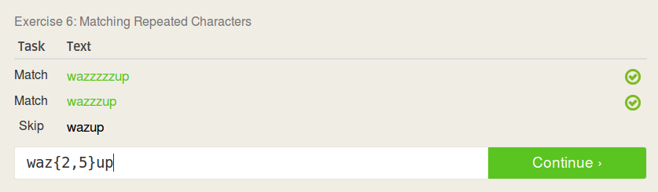

# Readings
## Open Source definition:
The critera listed are important to make a consistent definition of what oepn wource is, and to make sure that all open soure products have as much freedom as possible

## Smart Questions
1. Explain why a solution works, or might work. It helps the user to avoid having other, similar issues in the future
2. Don't come in with the assumption that the user has no idea what they are doing

## Free Culture
After reading the chapter, I feel frustration towards the situaton and the industry in general. I feel that Jesse had done very little wrong, and he clearly had no intention of doing something wrong. The book did come across as very biased about how they viewed the situation. I think that artists should recieve some amount of compensation for the work that they create, but I also feel that the average person should be able to somewhate easily access the works. Historically, the only real way to get access to music was to listen on the radio, where the radio station would pay to play the music and make money through selling advertisements, or simply buying the music. In 2002, when this situation occurred, it seems that the industry had not yet really figured out how to deal with the digital realm for music. Nowadays, there are many different free ways to listen to music, from YouTube to Pandora and Spotify, each with different business models. As the internet and music on the internet developed, the monetization for music has been improved so that people aren't being sued for millions of dollars for just creating a simple search engine.

# Linux

## Tree

# Regex

## regexone

