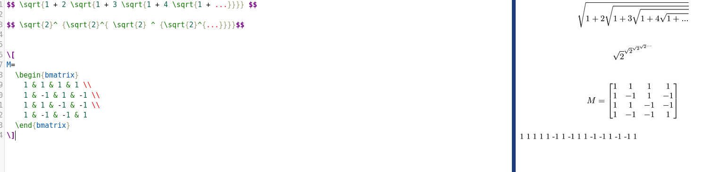
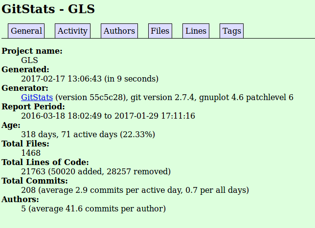
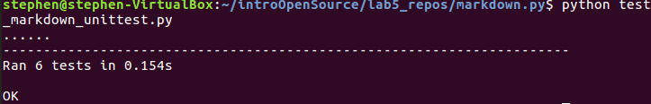

# Part 0

# Part 1

* Full screen pokemon
	* number contributors: 9
	* number lines of code: 331599
	* first commit: Jan 1 2015
	* latest commit: Jan 28 2017
	* current branches: 15

* GLS
	* number contributors: 4
	* number lines of code: 21646
	* first commit: Mar 21 2016
	* latest commit: Jan 25 2017
	* current branches: 7

* grobot
	* number contributors: 1
	* number lines of code: 169
	* first commit: Nov 24 2016
	* latest commit: Jan 28 2017
	* current branches: 5

* Mergeable
	* number contributors: 2
	* number lines of code: 672
	* first commit: Jan 25 2017
	* latest commit: Jan 29 2017
	* current branches: 3

* RRS-RCOS
	* number contributors: 1
	* number lines of code: 252979
	* first commit: August 23 2016
	* latest commit: Dec 14 2016
	* current branches: 2

This looks mostly similar to what I found

video: https://youtu.be/ZyMKhlX_YM0

# Part 2
